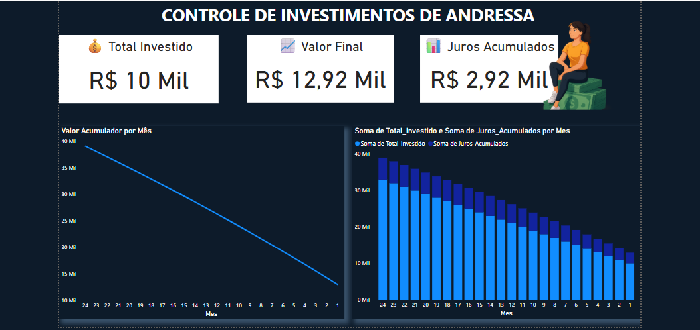

# 📊 Controle de Investimentos - Power BI + SQL

Projeto fictício de controle e projeção de investimentos mensais com atualização automática via Power BI e SQL Server.

---

## 💡 Sobre o projeto

Este projeto foi criado para simular o acompanhamento de um investimento de longo prazo com aporte mensal e juros compostos, baseado em uma taxa anual de 13,43% (renda fixa, PicPay ou similar).

- Investimento inicial: R$ 10.000,00
- Aporte mensal: R$ 1.000,00 (variável)
- Período: 24 meses
- Taxa de juros: 13,43% ao ano (juros compostos)
- Base de dados: SQL Server
- Visualização: Power BI

---

## ⚙️ Tecnologias usadas

- SQL Server (para cálculo de projeções)
- Power BI Desktop
- DAX para medidas (Juros, Valor Acumulado, Total Investido)
- Atualização automática do dashboard com base na data atual

---

## 📸 Visual do Dashboard

---

## 🔁 Atualização automática

A cada mês, o Power BI se conecta ao SQL e calcula:

- Total investido atual
- Juros acumulados
- Valor final acumulado

> Os dados mudam automaticamente com o passar dos meses sem precisar editar manualmente.

---

## 🧠 O que aprendi

- Criar **CTEs em SQL** para simulação de projeções financeiras
- Conectar Power BI a bancos de dados relacionais
- Criar **dashboards interativos** com segmentações e medidas DAX
- Simular investimentos reais usando dados fictícios

---

## 🚀 Por que estou compartilhando?

Este projeto é parte da minha jornada de aprendizado em **Power BI + SQL** voltado para área de finanças. Mesmo sendo da área de Administração e Finanças, estou desenvolvendo habilidades técnicas para trabalhar com dados de forma profissional.

